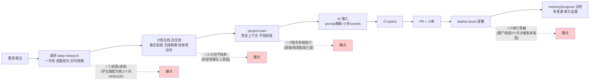
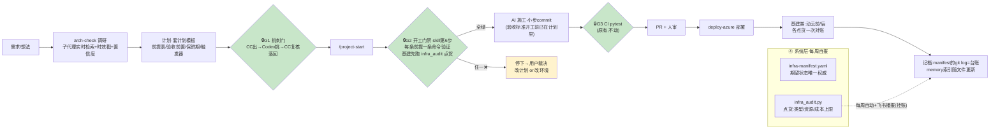

# 长任务开发架构图：优化前 vs 优化后（2026-09-21）

> 图为 mermaid,GitHub / VS Code 直接渲染。
> 依据:Azure 事故全链复盘 + 四层对齐机制(同日落地,见 `计划模板.md` / `infra-manifest.yaml` / `infra_audit.py`)。

## 一、优化前 —— 纪律靠「记得」,四层各有一个沉默爆点



**特征**:器官都在(分支/CI/活文档/双验/复盘都有),但**触发靠自觉**——①②只在"重大选型"手动触发过,③④从不存在。

## 二、优化后 —— 同一套器官,四道闸自动跳



## 三、四层对齐 → 闸门归属

```
需求  ↔  计划   ↔   代码   ↔   运行系统
      G1+验收前置  G2+G3      点货(动云对账+每周)
```

## 四、你的工作流环节 × 优化前后对照

| 你现有的环节 | 优化前 | 优化后 | 状态 |
|---|---|---|---|
| 调研(deep research) | 一次性纸面结论 | arch-check:实时检索+时效戳+多源交叉 | ✅ skill 已有 |
| 计划活文档(iOS计划式任务表) | 散文前提、验收后补 | 套计划模板:前提表/验收前置/保鲜期/挑刺栏 | ✅ 模板已建 |
| CC·Codex 双验证 | 重大选型手动触发 | **所有计划必过**(G1),纯代码小改可豁免 | ✅ 写进模板纪律 |
| /project-start | 恢复上下文即开工 | +第6步开工门禁:前提逐条命令验证,❌不放行 | ✅ skill 已改 |
| prompt 模板(任务→模块→文件→约束→验收) | 验收栏常后补 | 验收=开工前写完才准动工 | ✅ 模板纪律 |
| PR + CI pytest | 有 | 不变(本来就是对的组织) | ✅ 原样 |
| deploy-azure 部署 | 部署完看 health | +动云前后各点货一次 | 🟡 skill 待补一行 |
| memory / progress 记档 | 多真源、索引腐化 | manifest git log=执行台账;索引随文件更新 | 🟡 纪律已立,自动播报挂账 |
| (新增)infra-manifest + 点货脚本 | 不存在 | 系统层闸门:类型/资源/成本三对表 | ✅ 已建实测全绿 |
| (新增)每周飞书自动播报 | 不存在 | 执行层自己来报账 | ⬜ 挂账(动共享 workflow 前需群里知会) |

## 五、一次长任务的标准走法(优化后,可直接照跑)

1. `/project-start` → 状态报告 + **前提验证表**(G2 首验)
2. 套 `计划模板.md` 建计划:前提配命令、验收前置、保鲜期与触发器
3. 过 **G1 挑刺门**:Codex 挑 → CC 复核落回计划
4. **G2** 全绿 → 施工;小步 commit
5. PR → **G3** CI → 人审
6. 部署(deploy-azure);基建类动云前后各 `python3 scripts/infra_audit.py` 一次
7. `/project-done` 记档
8. **长任务跨多天:每次新会话回第 1 步**——G2 天天重验(前提会隔夜变,这正是保鲜期存在的意义)

> 一句话:优化不是换架构,是给原有器官装上自动跳的神经——**每个错误在发生的那一秒大吵大闹,而不是三个月后用账单通知你。**
